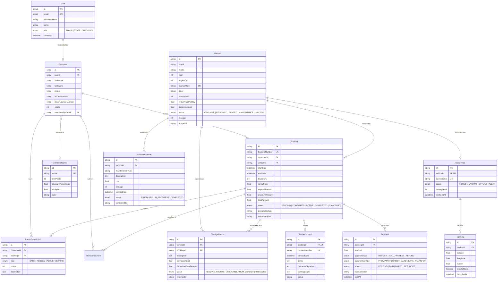

# รายงานโครงงานพัฒนาระบบฐานข้อมูล
## เรื่อง: ระบบจัดการเช่ารถบิ๊กไบค์ (BIG BIKE RENTAL MANAGEMENT SYSTEM)

---

**จัดทำโดย**  
นางสาวจีรนันท์ เกิดกล้า  
รหัสนักศึกษา 6712732121  

**อาจารย์ที่ปรึกษา / ผู้ตรวจรายงาน**  
ผู้ช่วยศาสตราจารย์ ดร.กนิษฐา อินธิชิต  

**รายงานนี้เป็นส่วนหนึ่งของรายวิชาระบบฐานข้อมูล (4123202+)**  
**ภาคเรียนที่ 2 ปีการศึกษา 2568**  
**สาขาวิทยาการคอมพิวเตอร์ คณะศิลปศาสตร์และวิทยาศาสตร์**  
**มหาวิทยาลัยราชภัฏศรีสะเกษ**  

---

## สารบัญ (Table of Contents)

| ลำดับหัวข้อ | รายละเอียด | หน้า |
|---|---|---|
| **บทที่ 1** | **ความต้องการของระบบ (Requirement & System Specification)** | 1 |
| **บทที่ 2** | **แผนภาพความสัมพันธ์ของข้อมูล (E-R Diagram & Relationship Analysis)** | 4 |
| **บทที่ 3** | **พจนานุกรมข้อมูล (Data Dictionary & Database Schema)** | 7 |
| **บทที่ 4** | **การออกแบบส่วนต่อประสานผู้ใช้ (User Interface: UI / UX Walkthrough)** | 14 |
| **บทที่ 5** | **สรุปผลการพัฒนาระบบและเทคโนโลยีที่ใช้ (Tech Stack & Conclusion)** | 19 |

---

# บทที่ 1: ความต้องการของระบบ (Requirement)

## 1.1 ที่มาและความสำคัญ
ธุรกิจบริการเช่ารถจักรยานยนต์ขนาดใหญ่ (Big Bike Rental) มีมูลค่าทรัพย์สินของยานพาหนะสูง (ตั้งแต่ 400,000 ถึง 1,500,000+ บาทต่อคัน) และมีขั้นตอนการดำเนินงานที่ซับซ้อน ได้แก่ การตรวจสอบความว่างของรถเพื่อป้องกันการจองคิวชนกัน (Booking Conflict), การตรวจสอบใบอนุญาตขับขี่, การจัดเก็บเงินมัดจำความเสียหาย (Security Deposit), การติดตามตำแหน่งรถด้วยระบบดาวเทียม GPS เพื่อป้องกันการโจรกรรม และการบำรุงรักษาตามรอบระยะทาง

โครงงานนี้จึงมุ่งเน้นการพัฒนา **"BIG BIKE RENTAL MANAGEMENT SYSTEM"** ซึ่งเป็นระบบเว็บแอปพลิเคชันแบบ Full-Stack เพื่อบริหารจัดการร้านเช่ารถบิ๊กไบค์ 1 สาขาหลักอย่างครบวงจร

---

## 1.2 วัตถุประสงค์ของระบบ
1. เพื่อพัฒนาระบบจองรถบิ๊กไบค์ออนไลน์ที่สามารถตรวจสอบช่วงเวลาว่างของรถแบบเรียลไทม์ (Conflict Prevention)
2. เพื่อพัฒนาระบบบริหารจัดการลูกค้าและระบบสะสมแต้มสมาชิก (Loyalty Points & Tier System: Bronze, Silver, Gold, Platinum)
3. เพื่อพัฒนาระบบชำระเงินดิจิทัลผ่าน PromptPay QR Code พร้อมการตรวจสอบสลิปและกำหนดเวลานับถอยหลัง 15 นาที
4. เพื่อพัฒนาระบบออกสัญญาเช่าดิจิทัล (Digital Rental Contract)
5. เพื่อพัฒนาระบบติดตามยานพาหนะด้วย GPS และตรวจจับการขับออกนอกเขตพื้นที่ปลอดภัย (Geofence Alert)
6. เพื่อพัฒนาระบบบันทึกความเสียหายและหักเงินมัดจำ (Damage Report & Deposit Deduction)
7. เพื่อพัฒนาระบบวางแผนซ่อมบำรุงรถตามระยะทางและรอบเวลา (Fleet Maintenance Scheduler)

---

## 1.3 ขอบเขตและสิทธิ์ของผู้ใช้งาน (User Roles & Permissions)

ระบบแบ่งผู้ใช้งานออกเป็น 3 ระดับ (Role-Based Access Control):

```
                       ┌─────────────────────────────────────────┐
                       │     BIG BIKE RENTAL MANAGEMENT SYSTEM   │
                       └────────────────────┬────────────────────┘
                                            │
        ┌───────────────────────────────────┼───────────────────────────────────┐
        ▼                                   ▼                                   ▼
┌────────────────┐                 ┌─────────────────┐                 ┌─────────────────┐
│ CUSTOMER       │                 │ STAFF           │                 │ ADMIN           │
│ (ลูกค้าผู้เช่า) │                 │ (พนักงานหน้าร้าน)│                 │ (ผู้บริหารระบบ) │
├────────────────┤                 ├─────────────────┤                 ├─────────────────┤
│ • สมัคร/ล็อกอิน │                 │ • ตรวจสอบเอกสาร  │                 │ • แดชบอร์ด KPI  │
│ • ค้นหา/กรองรถ │                 │ • ส่งมอบ/รับรถคืน│                 │ • จัดการกองรถ   │
│ • จอง 5 ขั้นตอน│                 │ • ออกสัญญาเช่า   │                 │ • ติดตาม GPS สด │
│ • แลกแต้มสมาชิก │                 │ • บันทึกความเสีย │                 │ • จัดการสมาชิก  │
│ • ดูสัญญา/สถานะ│                 │ • กำหนดซ่อมบำรุง │                 │ • ดูรายงานการเงิน│
└────────────────┘                 └─────────────────┘                 └─────────────────┘
```

### 1. ลูกค้า (Customer)
* ค้นหาและคัดกรองรถบิ๊กไบค์ตามยี่ห้อ (Ducati, BMW, Yamaha, Kawasaki, Honda, Suzuki, Harley-Davidson, Triumph), ขนาด CC, และช่วงราคา
* ดำเนินการจองรถผ่าน Wizard 5 ขั้นตอน (เลือกวัน/สถานที่ -> กรอกข้อมูลผู้ขับขี่ -> ใช้สิทธิประโยชน์สมาชิก/แลกแต้ม -> ชำระเงิน PromptPay QR -> รับสัญญาเช่าดิจิทัล)
* ตรวจสอบประวัติการจองและสถานะรถในหน้า "การจองของฉัน (My Bookings)"
* ตรวจสอบระดับสมาชิก (Membership Tier) แต้มสะสม และประวัติการได้รับแต้ม

### 2. พนักงาน (Staff)
* ตรวจสอบเอกสารบัตรประชาชนและใบอนุญาตขับขี่ของลูกค้า
* ดำเนินการส่งมอบรถ (Check-in) และรับรถคืน (Check-out) พร้อมบันทึกเลขไมล์ล่าสุด
* บันทึกรายงานความเสียหาย (Damage Report) พร้อมแนบรูปถ่ายหลักฐานและคำนวณเงินหักจากมัดจำ
* สร้างตารางนัดหมายการซ่อมบำรุงรถบิ๊กไบค์ (Maintenance Schedule)

### 3. ผู้ดูแลระบบ (Admin)
* เข้าถึงแผงควบคุมหลัก (Admin Dashboard) ดูสถิติ KPI, ยอดรายได้รวม, กราฟแนวโน้มรายได้ และอัตราการใช้งานรถ
* เพิ่ม ลบ แก้ไข ข้อมูลรถบิ๊กไบค์ พร้อมฟังก์ชัน **อัปโหลดรูปภาพจากเครื่องคอมพิวเตอร์**
* ติดตามตำแหน่งรถผ่านระบบ **แผนที่ดาวเทียม GPS แบบเรียลไทม์ (Live Interactive Map)** พร้อมแจ้งเตือนเมื่อรถออกนอกรัศมี 35 กม.
* จัดการระดับสมาชิกและอัตราส่วนลดแต้มสะสม
* ดูรายงานสรุปรายได้ การจอง และส่งออกรายงาน (CSV Report Export)

---

# บทที่ 2: แผนภาพความสัมพันธ์ของข้อมูล (E-R Diagram)

## 2.1 แผนภาพ E-R Diagram (Entity-Relationship Diagram)




---

## 2.2 การวิเคราะห์ความสัมพันธ์ของข้อมูล (Relationship Analysis & Normalization)

ฐานข้อมูลได้รับการออกแบบตามหลักเกณฑ์ **3NF (Third Normal Form)** เพื่อลดความซ้ำซ้อนของข้อมูล และป้องกันข้อผิดพลาดในการ Update/Delete Anomaly:

1. **User ↔ Customer (1:1):** บัญชีผู้ใช้ 1 บัญชีผูกกับโปรไฟล์ลูกค้า 1 ราย โดยแยกตารางเพื่อรองรับผู้ใช้ที่เป็น Staff และ Admin ที่ไม่จำเป็นต้องมีข้อมูลใบขับขี่
2. **MembershipTier ↔ Customer (1:M):** ลูกค้า 1 คน สังกัดระดับสมาชิกได้ 1 ระดับในขณะนั้น แต่ 1 ระดับสมาชิกสามารถมีลูกค้าได้หลายคน
3. **Vehicle ↔ Booking (1:M):** รถบิ๊กไบค์ 1 คัน สามารถมีประวัติการจองได้หลายครั้ง แต่ละการจองจะผูกกับรถ 1 คัน โดยมีระบบตรวจเช็คช่วงเวลาซ้ำซ้อน (Date Overlap Check)
4. **Booking ↔ Payment (1:M):** การจอง 1 รายการสามารถมีประวัติการชำระเงินได้หลายครั้ง (เช่น จ่ายเงินค่าเช่า + จ่ายเงินมัดจำ + จ่ายค่าปรับความเสียหาย)
5. **Booking ↔ RentalContract (1:1):** การจองที่ได้รับการอนุมัติแล้ว 1 รายการ จะมีสัญญาเช่าอิเล็กทรอนิกส์กำกับ 1 ฉบับอย่างเคร่งครัด
6. **Vehicle ↔ GpsDevice (1:1):** รถบิ๊กไบค์ 1 คันติดตั้งกล่อง GPS ติดตามประจำตัวรถได้ 1 กล่อง
7. **GpsDevice ↔ GpsLog (1:M):** กล่อง GPS 1 กล่องส่งสัญญาณพิกัด ความเร็ว และสถานะความปลอดภัยบันทึกลงฐานข้อมูลได้อย่างต่อเนื่อง
8. **Vehicle ↔ DamageReport & MaintenanceLog (1:M):** รถ 1 คันสามารถเก็บบันทึกประวัติการเคลมความเสียหายและประวัติการเข้าศูนย์บริการถ่ายน้ำมันเครื่องได้ตลอดอายุการใช้งาน

---

# บทที่ 3: พจนานุกรมข้อมูล (Data Dictionary)

ฐานข้อมูลจัดเก็บในระบบ **MySQL Database (`bigbike_rental`)** ประกอบด้วย 12 ตารางหลัก ดังนี้:

---

### 3.1 ตารางผู้ใช้งานระบบ (`User`)
ใช้จัดเก็บบัญชีผู้ใช้งาน สิทธิ์การเข้าถึง และการยืนยันตัวตน (Authentication)

| ชื่อฟิลด์ (Field) | ชนิดข้อมูล (Type) | คีย์ (Key) | Nullable | คำอธิบาย (Description) | ตัวอย่างข้อมูล |
|---|---|---|---|---|---|
| `id` | VARCHAR(191) | **PK** | No | รหัสผู้ใช้งาน (CUID) | `cmtk4edeg000i2mpurqt7fxiq` |
| `email` | VARCHAR(191) | **UK** | No | อีเมลผู้ใช้งาน (ใช้ล็อกอิน) | `admin@example.com` |
| `passwordHash` | VARCHAR(191) | - | No | รหัสผ่านเข้ารหัสด้วย bcrypt | `$2a$10$wT8m9...` |
| `name` | VARCHAR(191) | - | No | ชื่อ-นามสกุลผู้ใช้งาน | `Admin BigBike` |
| `role` | ENUM | - | No | สิทธิ์: `ADMIN`, `STAFF`, `CUSTOMER` | `ADMIN` |
| `avatarUrl` | TEXT | - | Yes | URL รูปโปรไฟล์ | `https://images.unsplash.com/...` |
| `createdAt` | DATETIME | - | No | วันที่สร้างบัญชี | `2026-09-01 10:00:00` |
| `updatedAt` | DATETIME | - | No | วันที่อัปเดตข้อมูลล่าสุด | `2026-09-01 10:00:00` |

---

### 3.2 ตารางข้อมูลลูกค้า (`Customer`)
ใช้จัดเก็บประวัติส่วนบุคคล ข้อมูลติดต่อ และแต้มสะสม

| ชื่อฟิลด์ (Field) | ชนิดข้อมูล (Type) | คีย์ (Key) | Nullable | คำอธิบาย (Description) | ตัวอย่างข้อมูล |
|---|---|---|---|---|---|
| `id` | VARCHAR(191) | **PK** | No | รหัสลูกค้า | `c_cust001` |
| `userId` | VARCHAR(191) | **FK, UK** | No | เชื่อมโยงกับ `User.id` | `cmtk4edeg000i2mpurqt7fxiq` |
| `firstName` | VARCHAR(191) | - | No | ชื่อจริง | `สมชาย` |
| `lastName` | VARCHAR(191) | - | No | นามสกุล | `สายหมอบ` |
| `phone` | VARCHAR(191) | **INDEX** | No | เบอร์โทรศัพท์มือถือ | `081-234-5678` |
| `address` | TEXT | - | Yes | ที่อยู่ติดต่อ | `123 ถ.สุขุมวิท 71 วัฒนา กทม.` |
| `idCardNumber` | VARCHAR(191) | **INDEX** | Yes | เลขประจำตัวประชาชน 13 หลัก | `1100400123456` |
| `driverLicenseNumber` | VARCHAR(191) | - | Yes | เลขที่ใบอนุญาตขับขี่ | `DL-66012948` |
| `points` | INT | - | No | แต้มสะสมปัจจุบัน | `1850` |
| `membershipTierId` | VARCHAR(191) | **FK** | Yes | เชื่อมโยงกับ `MembershipTier.id` | `tier_gold` |
| `createdAt` | DATETIME | - | No | วันที่สมัคร | `2026-09-01 10:00:00` |

---

### 3.3 ตารางระดับสมาชิก (`MembershipTier`)
ใช้จัดการอัตราส่วนลดและตัวคูณแต้มสะสม

| ชื่อฟิลด์ (Field) | ชนิดข้อมูล (Type) | คีย์ (Key) | Nullable | คำอธิบาย (Description) | ตัวอย่างข้อมูล |
|---|---|---|---|---|---|
| `id` | VARCHAR(191) | **PK** | No | รหัสระดับสมาชิก | `tier_gold` |
| `name` | VARCHAR(191) | **UK** | No | ชื่อระดับ (Bronze, Silver, Gold, Platinum) | `Gold Member` |
| `minPoints` | INT | - | No | แต้มขั้นต่ำในการปรับระดับ | `1000` |
| `discountPercentage`| FLOAT | - | No | เปอร์เซ็นต์ส่วนลดค่าเช่า | `10.0` (ลด 10%) |
| `multiplier` | FLOAT | - | No | ตัวคูณแต้มสะสม | `1.5` (รับแต้ม 1.5 เท่า) |
| `color` | VARCHAR(191) | - | No | โค้ดสีประจำระดับสมาชิก | `#f59e0b` |
| `perks` | TEXT | - | Yes | รายละเอียดสิทธิประโยชน์ | `ฟรีบริการส่งรถถึงที่พัก, อัปเกรดรุ่นรถฟรี` |

---

### 3.4 ตารางข้อมูลรถบิ๊กไบค์ (`Vehicle`)
ใช้จัดเก็บรายละเอียด กองรถ สเปกเครื่องยนต์ ราคา และสถานะ

| ชื่อฟิลด์ (Field) | ชนิดข้อมูล (Type) | คีย์ (Key) | Nullable | คำอธิบาย (Description) | ตัวอย่างข้อมูล |
|---|---|---|---|---|---|
| `id` | VARCHAR(191) | **PK** | No | รหัสประจำตัวรถ | `v_hayabusa_01` |
| `brand` | VARCHAR(191) | **INDEX** | No | ยี่ห้อ (Ducati, BMW, Yamaha, Suzuki...) | `Suzuki` |
| `model` | VARCHAR(191) | - | No | รุ่นรถ | `Hayabusa GSX1300R` |
| `year` | INT | - | No | ปีผลิต | `2024` |
| `engineCC` | INT | **INDEX** | No | ขนาดเครื่องยนต์ (ซีซี) | `1340` |
| `licensePlate` | VARCHAR(191) | **UK** | No | ป้ายทะเบียนรถ | `9กท 1340` |
| `color` | VARCHAR(191) | - | No | สีตัวรถ | `Glass Sparkle Black` |
| `category` | VARCHAR(191) | - | No | ประเภทรถ (Super Sport, Naked, Touring) | `Hyper Sport` |
| `horsepower` | INT | - | Yes | พละกำลังแรงม้า (HP) | `190` |
| `fuelType` | VARCHAR(191) | - | No | ชนิดน้ำมันเชื้อเพลิง | `Gasoline 95` |
| `transmission` | VARCHAR(191) | - | No | ระบบเกียร์ | `Manual 6-Speed Quickshifter` |
| `seatHeight` | INT | - | Yes | ความสูงเบาะนั่ง (มม.) | `800` |
| `weightKg` | INT | - | Yes | น้ำหนักตัวรถ (กก.) | `264` |
| `description` | TEXT | - | Yes | รายละเอียดและจุดเด่นของรถ | `พญาเหยี่ยวในตำนาน Gen 3...` |
| `imageUrl` | TEXT | - | No | URL หรือ Path รูปภาพหลัก | `/uploads/vehicles/bike_01.jpg` |
| `images` | TEXT | - | Yes | JSON String รายการรูปภาพเพิ่มเติม | `["/uploads/v1.jpg", "/uploads/v2.jpg"]` |
| `rentalPricePerDay` | FLOAT | **INDEX** | No | อัตราค่าเช่าต่อวัน (บาท) | `7900.0` |
| `depositAmount` | FLOAT | - | No | เงินมัดจำความเสียหาย (บาท) | `45000.0` |
| `status` | ENUM | **INDEX** | No | `AVAILABLE`, `RENTED`, `RESERVED`, `MAINTENANCE` | `AVAILABLE` |
| `mileage` | INT | - | No | เลขไมล์ปัจจุบัน (กม.) | `2800` |

---

### 3.5 ตารางรายการจองรถ (`Booking`)
ใช้จัดเก็บประวัติการเช่า การคำนวณราคา วันที่ และสถานที่รับ-ส่งรถ

| ชื่อฟิลด์ (Field) | ชนิดข้อมูล (Type) | คีย์ (Key) | Nullable | คำอธิบาย (Description) | ตัวอย่างข้อมูล |
|---|---|---|---|---|---|
| `id` | VARCHAR(191) | **PK** | No | รหัสการจอง | `bk_001` |
| `bookingNumber` | VARCHAR(191) | **UK** | No | หมายเลขใบจองอ้างอิง | `BK250501-001` |
| `customerId` | VARCHAR(191) | **FK** | No | เชื่อมโยงกับ `Customer.id` | `c_cust001` |
| `vehicleId` | VARCHAR(191) | **FK** | No | เชื่อมโยงกับ `Vehicle.id` | `v_hayabusa_01` |
| `startDate` | DATETIME | **INDEX** | No | วันที่และเวลารับรถ | `2026-09-10 09:00:00` |
| `endDate` | DATETIME | **INDEX** | No | วันที่และเวลาคืนรถ | `2026-09-13 18:00:00` |
| `totalDays` | INT | - | No | จำนวนวันเช่ารวม | `3` |
| `rentalPrice` | FLOAT | - | No | ค่าเช่ารวม (ก่อนหักส่วนลด) | `23700.0` |
| `depositAmount` | FLOAT | - | No | เงินมัดจำความเสียหาย | `45000.0` |
| `discountAmount` | FLOAT | - | No | มูลค่าส่วนลดจากระดับสมาชิก | `2370.0` (ลด 10%) |
| `pointsUsed` | INT | - | No | จำนวนแต้มสะสมที่นำมาแลก | `100` |
| `pointsDiscount` | FLOAT | - | No | มูลค่าส่วนลดจากการแลกแต้ม (1 แต้ม = 1 บ.) | `100.0` |
| `totalAmount` | FLOAT | - | No | ยอดชำระสุทธิ (ค่าเช่า + มัดจำ - ส่วนลด) | `66230.0` |
| `status` | ENUM | **INDEX** | No | `PENDING`, `CONFIRMED`, `ACTIVE`, `COMPLETED` | `CONFIRMED` |
| `pickupLocation` | VARCHAR(191) | - | No | จุดรับรถ | `สาขากรุงเทพฯ (สุขุมวิท 71)` |
| `returnLocation` | VARCHAR(191) | - | No | จุดคืนรถ | `สนามบินสุวรรณภูมิ` |
| `notes` | TEXT | - | Yes | หมายเหตุเพิ่มเติมจากลูกค้า | `ขอรับหมวกกันน็อคไซส์ L เพิ่ม 1 ใบ` |

---

### 3.6 ตารางการชำระเงิน (`Payment`)
เก็บบันทึกประวัติธุรกรรมการเงิน สลิปโอน และช่องทางการชำระ

| ชื่อฟิลด์ (Field) | ชนิดข้อมูล (Type) | คีย์ (Key) | Nullable | คำอธิบาย (Description) | ตัวอย่างข้อมูล |
|---|---|---|---|---|---|
| `id` | VARCHAR(191) | **PK** | No | รหัสรายการชำระเงิน | `pay_001` |
| `bookingId` | VARCHAR(191) | **FK** | No | เชื่อมโยงกับ `Booking.id` | `bk_001` |
| `amount` | FLOAT | - | No | จำนวนเงินที่ทำรายการ | `66230.0` |
| `paymentType` | ENUM | - | No | `FULL_PAYMENT`, `DEPOSIT`, `REFUND` | `FULL_PAYMENT` |
| `paymentMethod` | ENUM | - | No | `PROMPTPAY`, `CREDIT_CARD`, `BANK_TRANSFER` | `PROMPTPAY` |
| `status` | ENUM | **INDEX** | No | `PENDING`, `PAID`, `FAILED`, `REFUNDED` | `PAID` |
| `transactionId` | VARCHAR(191) | - | Yes | รหัสอ้างอิงสลิป/ธุรกรรมธนาคาร | `TXN-PP-99018291` |
| `slipUrl` | TEXT | - | Yes | ที่อยู่ไฟล์รูปภาพสลิปโอนเงิน | `/uploads/slips/slip_01.jpg` |
| `paidAt` | DATETIME | - | Yes | วันและเวลาที่ชำระเงินสำเร็จ | `2026-09-02 21:30:00` |

---

### 3.7 ตารางสัญญาเช่าดิจิทัล (`RentalContract`)
จัดเก็บเงื่อนไขสัญญาเช่าและลายมือชื่ออิเล็กทรอนิกส์

| ชื่อฟิลด์ (Field) | ชนิดข้อมูล (Type) | คีย์ (Key) | Nullable | คำอธิบาย (Description) | ตัวอย่างข้อมูล |
|---|---|---|---|---|---|
| `id` | VARCHAR(191) | **PK** | No | รหัสสัญญาเช่า | `ctr_001` |
| `bookingId` | VARCHAR(191) | **FK, UK** | No | เชื่อมโยงกับ `Booking.id` (1:1) | `bk_001` |
| `contractNumber` | VARCHAR(191) | **UK** | No | เลขที่สัญญาเช่าทางการ | `CTR-2026-0001` |
| `contractDate` | DATETIME | - | No | วันที่ทำสัญญา | `2026-09-02 21:35:00` |
| `terms` | TEXT | - | No | ข้อกำหนดและเงื่อนไขความคุ้มครอง | `ผู้เช่าตกลงยินยอมรับผิดชอบความเสียหาย...` |
| `customerSignature`| TEXT | - | Yes | ลายมือชื่อดิจิทัลของผู้เช่า | `DIGITAL_SIG_SOMCHAI_HASH` |
| `staffSignature` | TEXT | - | Yes | ลายมือชื่อพนักงานผู้ส่งมอบรถ | `DIGITAL_SIG_STAFF_OFFICIAL` |
| `status` | VARCHAR(191) | - | No | สถานะสัญญา (`ACTIVE`, `CLOSED`) | `ACTIVE` |

---

### 3.8 ตารางอุปกรณ์ติดตาม GPS (`GpsDevice`)
จัดเก็บรหัสกล่องและสถานะการเชื่อมต่อ

| ชื่อฟิลด์ (Field) | ชนิดข้อมูล (Type) | คีย์ (Key) | Nullable | คำอธิบาย (Description) | ตัวอย่างข้อมูล |
|---|---|---|---|---|---|
| `id` | VARCHAR(191) | **PK** | No | รหัสกล่อง GPS | `gps_dev_01` |
| `vehicleId` | VARCHAR(191) | **FK, UK** | No | รหัสรถที่ติดตั้งกล่องนี้ | `v_hayabusa_01` |
| `deviceSerial` | VARCHAR(191) | **UK** | No | หมายเลข Serial ประจำกล่อง | `GPS-SZ-1340` |
| `status` | ENUM | - | No | `ACTIVE`, `INACTIVE`, `OFFLINE`, `ALERT` | `ACTIVE` |
| `batteryLevel` | INT | - | No | ระดับแบตเตอรี่สำรอง (%) | `98` |
| `lastSeenAt` | DATETIME | - | No | เวลาที่สัญญาณส่งเข้ามาล่าสุด | `2026-09-03 04:00:00` |

---

### 3.9 ตารางบันทึกพิกัดดาวเทียม (`GpsLog`)
บันทึกประวัติพิกัด ความเร็ว และสถานะความปลอดภัย

| ชื่อฟิลด์ (Field) | ชนิดข้อมูล (Type) | คีย์ (Key) | Nullable | คำอธิบาย (Description) | ตัวอย่างข้อมูล |
|---|---|---|---|---|---|
| `id` | VARCHAR(191) | **PK** | No | รหัสบันทึกพิกัด | `log_001` |
| `deviceId` | VARCHAR(191) | **FK** | No | เชื่อมโยงกับ `GpsDevice.id` | `gps_dev_01` |
| `latitude` | FLOAT | - | No | ละติจูด (Latitude) | `13.7563` |
| `longitude` | FLOAT | - | No | ลองจิจูด (Longitude) | `100.5018` |
| `speed` | FLOAT | - | No | ความเร็วรถ ณ ขณะนั้น (km/h) | `65.0` |
| `heading` | FLOAT | - | Yes | ทิศทางมุ่งหน้า (องศา) | `90.0` |
| `isOutOfZone` | BOOLEAN | - | No | แจ้งเตือนขับออกนอกรัศมี 35 กม. | `false` |
| `recordedAt` | DATETIME | **INDEX** | No | เวลาที่บันทึกพิกัด | `2026-09-03 04:00:00` |

---

### 3.10 ตารางรายงานความเสียหาย (`DamageReport`)
บันทึกการเคลมความเสียหายเมื่อลูกค้านำรถมาส่งมอบคืน

| ชื่อฟิลด์ (Field) | ชนิดข้อมูล (Type) | คีย์ (Key) | Nullable | คำอธิบาย (Description) | ตัวอย่างข้อมูล |
|---|---|---|---|---|---|
| `id` | VARCHAR(191) | **PK** | No | รหัสรายงานความเสียหาย | `dmg_001` |
| `vehicleId` | VARCHAR(191) | **FK** | No | เชื่อมโยงกับ `Vehicle.id` | `v_hayabusa_01` |
| `bookingId` | VARCHAR(191) | **FK** | Yes | เชื่อมโยงกับการจองครั้งนั้น | `bk_001` |
| `description` | TEXT | - | No | รายละเอียดจุดที่เกิดความเสียหาย | `รอยครูดบริเวณการ์ดท่อไอเสียด้านซ้าย` |
| `estimatedCost` | FLOAT | - | No | ค่าประเมินความเสียหาย (บาท) | `2500.0` |
| `deductionFromDeposit`| FLOAT | - | No | ยอดเงินที่หักจริงจากเงินมัดจำ | `2500.0` |
| `evidenceImages`| TEXT | - | Yes | JSON String รายการรูปถ่ายความเสียหาย | `["/uploads/damage1.jpg"]` |
| `reportedBy` | VARCHAR(191) | - | No | เจ้าหน้าที่ผู้ตรวจรับรถ | `Staff BigBike` |
| `status` | ENUM | - | No | `PENDING_REVIEW`, `DEDUCTED_FROM_DEPOSIT` | `DEDUCTED_FROM_DEPOSIT` |

---

### 3.11 ตารางบันทึกการซ่อมบำรุง (`MaintenanceLog`)
ใช้บันทึกรอบการเช็คระยะและเปลี่ยนถ่ายอะไหล่

| ชื่อฟิลด์ (Field) | ชนิดข้อมูล (Type) | คีย์ (Key) | Nullable | คำอธิบาย (Description) | ตัวอย่างข้อมูล |
|---|---|---|---|---|---|
| `id` | VARCHAR(191) | **PK** | No | รหัสการซ่อมบำรุง | `mnt_001` |
| `vehicleId` | VARCHAR(191) | **FK** | No | รหัสรถที่เข้ารับบริการ | `v_hayabusa_01` |
| `maintenanceType`| VARCHAR(191) | - | No | ประเภทงานซ่อม | `10,000 KM Major Service` |
| `description` | TEXT | - | No | รายการซ่อม | `เปลี่ยนถ่ายน้ำมันเครื่องสังเคราะห์ 100% & ไส้กรอง` |
| `cost` | FLOAT | - | No | ค่าใช้จ่ายรวม (บาท) | `6800.0` |
| `mileage` | INT | - | No | เลขไมล์ ณ วันที่เข้ารับบริการ | `10100` |
| `serviceDate` | DATETIME | - | No | วันที่นำรถเข้าศูนย์ | `2026-09-01 10:00:00` |
| `status` | ENUM | **INDEX** | No | `SCHEDULED`, `IN_PROGRESS`, `COMPLETED` | `COMPLETED` |
| `performedBy` | VARCHAR(191) | - | Yes | ศูนย์บริการ / ช่างผู้รับผิดชอบ | `Bangkok Superbike Official Center` |

---

### 3.12 ตารางประวัติแต้มสมาชิก (`PointsTransaction`)
บันทึกประวัติการได้แต้มและการแลกแต้มของลูกค้า

| ชื่อฟิลด์ (Field) | ชนิดข้อมูล (Type) | คีย์ (Key) | Nullable | คำอธิบาย (Description) | ตัวอย่างข้อมูล |
|---|---|---|---|---|---|
| `id` | VARCHAR(191) | **PK** | No | รหัสธุรกรรมแต้ม | `pts_001` |
| `customerId` | VARCHAR(191) | **FK** | No | เชื่อมโยงกับ `Customer.id` | `c_cust001` |
| `bookingId` | VARCHAR(191) | **FK** | Yes | เชื่อมโยงกับการจองที่ทำให้เกิดแต้ม | `bk_001` |
| `type` | ENUM | - | No | `EARN` (ได้รับ), `REDEEM` (แลกใช้) | `EARN` |
| `points` | INT | - | No | จำนวนแต้ม (+ ได้รับ / - แลก) | `+450` |
| `description` | TEXT | - | No | รายละเอียดของธุรกรรม | `รับแต้มสะสม 1.5 เท่า จากการเช่าบิ๊กไบค์ BK250501-001` |
| `createdAt` | DATETIME | - | No | วันเวลาที่ทำรายการ | `2026-09-02 21:40:00` |

---

# บทที่ 4: การออกแบบส่วนต่อประสานผู้ใช้ (User Interface: UI)

การออกแบบ User Interface ยึดหลัก **Modern Automotive & Premium Dark Glassmorphism** โดยเน้นความสวยงามระดับพรีเมียม ความคมชัดของข้อมูล (High Contrast) และ Responsive Design รองรับการแสดงผลทุกหน้าจอ

---

## 4.1 หน้าฝั่งลูกค้า (Customer Portal)

### 1. หน้าแรก (Hero & Featured Fleet Landing Page)
* **Hero Banner:** ภาพพื้นหลัง Superbike สวยงาม พร้อมข้อความหัวข้อไล่เฉดสี Gradient และปุ่มทางลัดไปยังหน้ารวมรถ
* **Metrics Counter:** ตัววัดสถิติ 100% สภาพรถเช็คศูนย์ทุกคัน, บริการฉุกเฉิน 24/7, และระบบรักษาความปลอดภัย GPS
* **Featured Fleet Showcase:** การ์ดแสดงรถยอดนิยม 6 คันแรก พร้อมระบุพละกำลัง (HP), ขนาดเครื่องยนต์ (CC), เงินมัดจำ และป้ายสถานะสีสดคมชัด
* **How It Works:** อธิบายขั้นตอนการเช่า 4 ขั้นตอนง่ายๆ (เลือกรุ่นรถ -> จองและระบุวัน -> ชำระเงิน/ทำสัญญา -> รับรถพร้อมซิ่ง)
* **Membership Club Banner:** กล่องประชาสัมพันธ์ระบบแต้มและสิทธิพิเศษสมาชิก

### 2. หน้ารวมรถและตัวกรองอัจฉริยะ (Vehicle Catalog & Dynamic Filters)
* **Brand Filter Pills:** แถบปุ่มคลิกเลือกยี่ห้อรถ (All, Ducati, BMW, Yamaha, Kawasaki, Honda, Suzuki, Harley-Davidson, Triumph)
* **Range & Status Filters:** ตัวเลือกคัดกรองขนาด CC, กรองสถานะรถ (พร้อมให้เช่า / จองแล้ว / ซ่อมบำรุง) และตัวเรียงลำดับราคา
* **Vehicle Card Item:** แสดงภาพรถ, สเปกแรงม้า, เกียร์, ความสูงเบาะ, ราคาเช่าต่อวัน และปุ่ม **"จองทันที"**

### 3. ระบบขั้นตอนการจอง 5 ขั้นตอน (5-Step Booking Wizard)
* **ขั้นตอนที่ 1 (เลือกวันและสถานที่):** เลือกวันรับรถ-คืนรถ พร้อมตรวจสอบคิวว่างอัตโนมัติ (Conflict Check) และเลือกจุดรับ-คืนรถจาก Dropdown สะดวก รวดเร็ว
* **ขั้นตอนที่ 2 (ข้อมูลผู้เช่าและใบขับขี่):** กรอกชื่อ-นามสกุล, เบอร์ติดต่อฉุกเฉิน, เลขบัตรประชาชน และเลขที่ใบอนุญาตขับขี่
* **ขั้นตอนที่ 3 (สิทธิประโยชน์สมาชิก):** แสดงระดับสมาชิกปัจจุบัน (Gold, Silver), คำนวณส่วนลดค่าเช่าอัตโนมัติ พร้อมช่องนำแต้มสะสมมาแลกเป็นส่วนลดเงินสด (1 แต้ม = 1 บาท)
* **ขั้นตอนที่ 4 (การชำระเงินดิจิทัล):** สร้าง PromptPay QR Code อัตโนมัติ พร้อมตัวจับเวลานับถอยหลัง 15 นาที และช่องทางบัตรเครดิต/โอนเงิน
* **ขั้นตอนที่ 5 (สัญญาเช่าดิจิทัล):** ออกหมายเลขการจองและสัญญาเช่าดิจิทัล (Digital Contract) ยืนยันการจองสำเร็จทันที

### 4. หน้าการจองของฉัน (My Bookings)
* แสดงประวัติการจองทั้งหมดของลูกค้า สถานะการชำระเงิน ปุ่มดูสัญญาเช่า และหมายเลขติดต่อสาขา

---

## 4.2 หน้าฝั่งผู้ดูแลระบบ (Admin Management Dashboard)

### 1. แผงควบคุมสถิติหลัก (Admin Overview Dashboard)
* **KPI Metrics Cards (5 ช่อง):** ยอดรายได้รวม (Total Revenue), จำนวนการจองทั้งหมด (Bookings), กองรถบิ๊กไบค์ทั้งหมด (Fleet Size), สมาชิกลูกค้า (Customers), และการแจ้งเตือนความปลอดภัย (Active Alerts)
* **Revenue Trend Graph:** กราฟแนวโน้มรายได้รายเดือนแบบ Bezier Curve สวยงาม
* **Donut Chart:** กราฟวงกลมแสดงสัดส่วนสถานะการจอง (อนุมัติแล้ว, กำลังเช่า, รอดำเนินการ, ซ่อมบำรุง)
* **Live GPS Mini Radar:** แผนที่เรดาร์พิกัดรถย่อส่วนในหน้าแรก

### 2. หน้าจัดการกองรถบิ๊กไบค์ (Fleet Management)
* ตารางข้อมูลรถบิ๊กไบค์ครบทุกมิติ (ยี่ห้อ, รุ่น, ทะเบียน, ซีซี, แรงม้า, ราคาเช่า, เงินมัดจำ, เลขไมล์, สถานะ)
* **ฟังก์ชันอัปโหลดรูปจากเครื่อง (Local File Upload):** Modal เพิ่ม/แก้ไขรถ มีปุ่ม **"📁 เลือกรูปภาพจากเครื่องคอมพิวเตอร์"** รองรับไฟล์ภาพสูงสุด 10MB พร้อมช่อง Live Image Preview แสดงตัวอย่างภาพทันที

### 3. ระบบติดตามยานพาหนะและควบคุมเขตปลอดภัย (Live GPS & Geofence Map)
* แผนที่ดาวเทียมและแผนที่ถนนจริง (Real Leaflet Map) แสดงพิกัดทั่วกรุงเทพฯ
* หมุดไฟ LED กระพริบระบุตำแหน่งรถ ความเร็ว `km/h` และระดับแบตเตอรี่
* ปักหมุดศูนย์ใหญ่สุขุมวิท 71 พร้อมวาดวงกลมรัศมีควบคุมความปลอดภัย **Geofence 35 กิโลเมตร**
* กล่องแจ้งเตือนด่วนสีแดงกระพริบเมื่อมีรถขับออกนอกเขตปลอดภัย พร้อมปุ่ม **"📞 โทรหาผู้เช่า"** ทันที

### 4. หน้าจัดการสัญญาและรายงานความเสียหาย (Damage & Maintenance)
* หน้าบันทึกการส่งมอบรถคืน บันทึกความเสียหาย แนบรูปถ่าย และคำนวณเงินหักจากมัดจำ
* หน้าวางแผนนัดหมายซ่อมบำรุงและเปลี่ยนถ่ายน้ำมันเครื่องตามระยะทาง

---

# บทที่ 5: สรุปผลการพัฒนาระบบและเทคโนโลยีที่ใช้

## 5.1 สรุปผลสัมฤทธิ์ของโครงงาน
ระบบ **BIG BIKE RENTAL MANAGEMENT SYSTEM** ได้รับการพัฒนาขึ้นตามข้อกำหนด (Requirements) ครบถ้วนทุกประการ:
1. รองรับการทำงานแบบ Full-Stack จริงทั้ง Frontend, Backend API, Authentication และ Database ORM
2. ฐานข้อมูลได้รับการปรับแต่งและเชื่อมต่อเข้ากับ **MySQL Database (`bigbike_rental`)** ผ่าน **phpMyAdmin** เป็นผลสำเร็จ
3. มีระบบป้องกันการจองรถชนคิวกันแบบอัตโนมัติ (Booking Conflict Prevention)
4. มีระบบสิทธิพิเศษสมาชิกที่คำนวณส่วนลดและแลกแต้มสะสมได้แบบเรียลไทม์
5. มีระบบแผนที่ดาวเทียม GPS ติดตามยานพาหนะบนแผนที่จริงอย่างสมบูรณ์แบบ
6. มีระบบอัปโหลดรูปภาพรถบิ๊กไบค์จากเครื่องคอมพิวเตอร์เข้าสู่ระบบได้อย่างสะดวก

---

## 5.2 ชุดเทคโนโลยีที่ใช้ในการพัฒนา (Technology Stack)

| ส่วนของระบบ | เทคโนโลยีที่เลือกใช้ (Technology Stack) | เหตุผลในการเลือกใช้ |
|---|---|---|
| **Frontend Framework** | **Next.js 14 (App Router) + React 18 + TypeScript** | รองรับ Server-Side Rendering (SSR), การทำ Routing ที่รวดเร็ว และ Type Safety |
| **Styling & Design** | **Tailwind CSS + Lucide Icons + Glassmorphism** | ปรับแต่ง UI ได้ยืดหยุ่น ดีไซน์หรูหรา ธีม Dark/Light สวยงาม และโหลดเร็ว |
| **Interactive Map** | **Leaflet + OpenStreetMap + CartoDB Dark Tiles** | แสดงแผนที่จริง พิกัดคมชัด ปักหมุดสด และวาด Geofence ได้อิสระโดยไม่มีค่าใช้จ่าย API |
| **Backend API** | **Next.js API Route Handlers (RESTful Architecture)** | ประมวลผล API ภายในเซิร์ฟเวอร์เดียว จัดการ Session และความปลอดภัยได้ดี |
| **Authentication** | **JWT (JSON Web Token) + HTTP-Only Cookies + bcryptjs** | รักษาความปลอดภัยในการ Login ป้องกันการถูกขโมย Token (XSS/CSRF Protection) |
| **ORM & Database Tool**| **Prisma ORM v5.22** | ทำ Type-Safe Queries, Migration, และ Database Push ได้อย่างเสถียร |
| **Database Server** | **MySQL Database / phpMyAdmin (Port 3306)** | ฐานข้อมูลมาตรฐานสากล รองรับ Transaction และความสัมพันธ์ของข้อมูลแบบ Relational |

---

**ลงชื่อผู้จัดทำ**  
..................................................  
( นางสาวจีรนันท์ เกิดกล้า )  
รหัสนักศึกษา 6712732121  
วันที่ 3 กันยายน 2568
